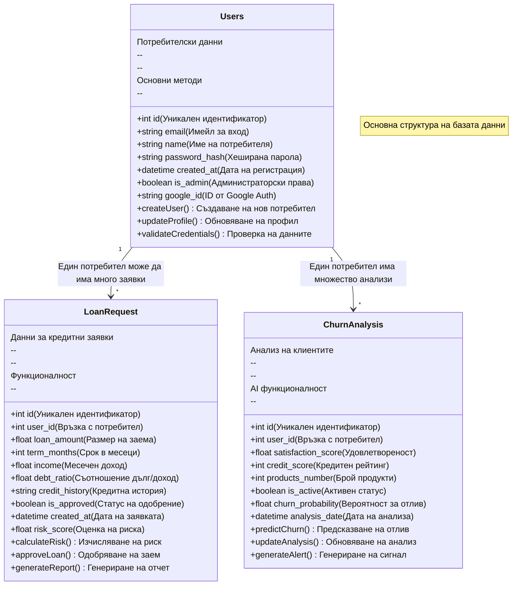
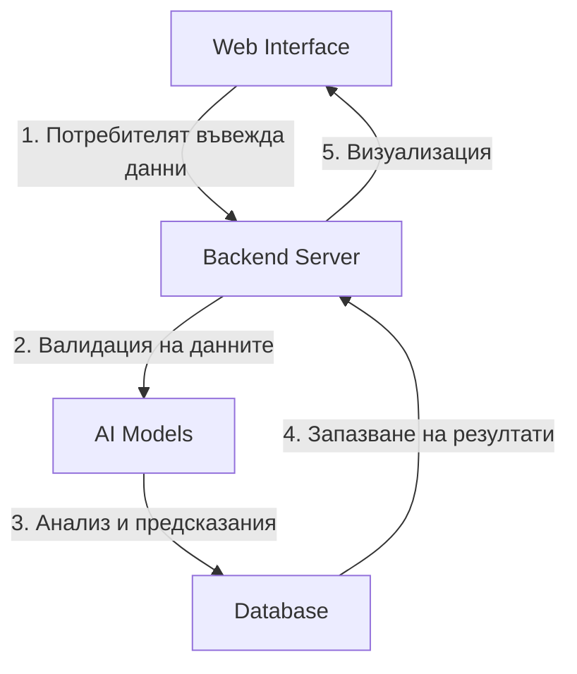
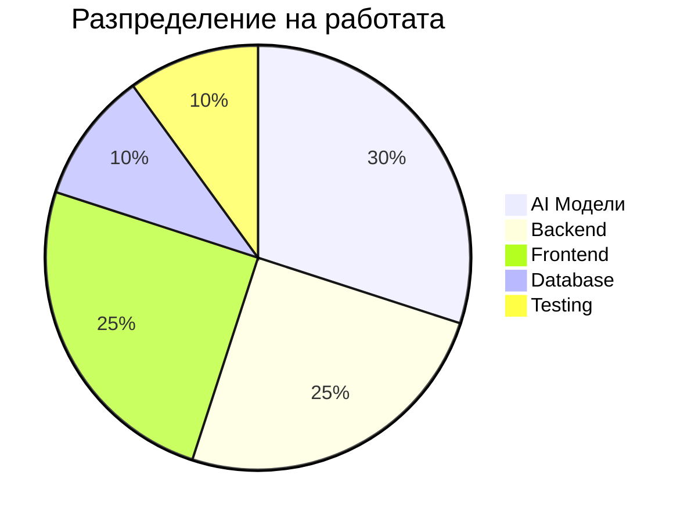

# BankTools_AI - Система за Банково Кредитиране с AI

## Въведение
BankTools_AI е иновативна система, която комбинира традиционно банково кредитиране с модерни AI технологии. Системата помага на банковите служители да вземат по-информирани решения за кредитиране и да предвидят потенциален отлив на клиенти.

### Основни функционалности:
- 🏦 Автоматизирана оценка на кредитни заявки
- 🤖 AI базирани предсказания за риск
- 📊 Анализ на клиентско поведение
- 🔐 Сигурна автентикация с Google
- 📱 Responsive уеб интерфейс

## 3. База данни (Database Schema) - 10 точки

### Обща информация за базата данни
Нашата база данни е проектирана да съхранява и управлява три основни типа информация:
1. Потребителски данни
2. Кредитни заявки
3. Анализи за отлив на клиенти

### Структура на базата данни


### Описание на връзките
- **Users → LoanRequest**: Един потребител може да подава множество заявки за кредит
- **Users → ChurnAnalysis**: За всеки потребител се правят периодични анализи за риск от отлив

## 4. AI и Уеб Интеграция - 10 точки

### Как работи системата?


### API Интерфейси

#### 1. Кредитни предсказания
```typescript
// Заявка за оценка на кредит
POST /api/loan-prediction
{
    "loan_amount": 50000,     // Сума на заема
    "term_months": 24,        // Срок в месеци
    "income": 5000,          // Месечен доход
    "debt_ratio": 0.3,       // Съотношение дълг/доход
    "credit_history": "good"  // Кредитна история
}

// Отговор от сървъра
Response: {
    "risk_score": 0.25,      // Оценка на риска (0-1)
    "is_approved": true,     // Препоръка за одобрение
    "confidence": 0.85       // Увереност в предсказанието
}
```

#### 2. Анализ на отлив
```typescript
// Заявка за анализ на клиент
POST /api/churn-prediction
{
    "satisfaction_score": 4.5,  // Оценка на удовлетвореност
    "credit_score": 750,        // Кредитен рейтинг
    "products_number": 3,       // Брой използвани продукти
    "is_active": true          // Активност на клиента
}

// Отговор от сървъра
Response: {
    "churn_probability": 0.15,  // Вероятност за отлив
    "risk_factors": [          // Рискови фактори
        "намаляваща активност",
        "спад в използването на продукти"
    ]
}
```

### AI Модели и Интерфейс

#### 1. Модел за Кредитни Предсказания

##### Интерфейс за Кредитни Заявки
```typescript
// Форма за кредитна заявка
interface LoanRequest {
    loan_amount: number;      // Сума на заема
    term_months: number;      // Срок в месеци
    income: number;          // Месечен доход
    purpose: string;         // Цел на кредита
    employment_years: number; // Години трудов стаж
    credit_score: number;    // Кредитен рейтинг
}
```

##### Процес на Обработка
1. **Въвеждане на данни**
   - 💰 Потребителят въвежда сумата на заема
   - ⏳ Избира срок на изплащане
   - 💵 Въвежда месечен доход
   - 🎯 Посочва цел на кредита
   - 💼 Въвежда трудов стаж
   - 📊 Предоставя кредитен рейтинг

2. **Автоматични Изчисления**
   - 📱 Калкулиране на месечна вноска в реално време
   - 📊 Изчисляване на съотношение дълг/доход
   - 💹 Оценка на финансовата стабилност

3. **AI Анализ**
   - ⚡ Бърза оценка на риска
   - 📈 Генериране на кредитен скор
   - ✅ Препоръка за одобрение/отказ

##### Визуализация на Резултати
- **Статус на заявката**: Одобрена ✅ / В разглеждане ⏳ / Отказана ❌
- **Оценка на риска**: Нисък 🟢 / Среден 🟡 / Висок 🔴
- **Препоръчителни действия**: Конкретни стъпки за подобряване на шансовете

#### 2. Модел за Анализ на Клиентско Поведение

##### Интерфейс за Мониторинг
```typescript
// Данни за клиентски анализ
interface CustomerAnalysis {
    user_id: string;         // ID на клиента
    activity_score: number;  // Оценка на активността
    products_used: string[]; // Използвани продукти
    last_transaction: Date;  // Последна транзакция
    satisfaction: number;    // Ниво на удовлетвореност
}
```

##### Функционалности
1. **Мониторинг на Активност**
   - 📊 Проследяване на транзакции
   - 🛍️ Използване на продукти
   - 💳 Активност по сметки

2. **Анализ на Поведение**
   - 📉 Промени в активността
   - 🎯 Предпочитани услуги
   - ⚠️ Сигнали за намалено ползване

3. **Автоматични Известия**
   - 🔔 Аларми при риск от отлив
   - 📧 Препоръки за задържане
   - 📱 Push нотификации

##### Dashboard за Банкови Служители
- **Общ преглед**: Статистика за всички клиенти
- **Рискови клиенти**: Списък с приоритетни случаи
- **Действия**: Препоръчителни мерки за задържане

### Техническа Реализация

#### Backend Endpoints
```python
@app.route('/api/loan-prediction', methods=['POST'])
def predict_loan():
    """
    Endpoint за кредитни предсказания
    """
    data = request.json
    prediction = loan_model.predict(data)
    return jsonify(prediction)

@app.route('/api/customer-analysis', methods=['POST'])
def analyze_customer():
    """
    Endpoint за анализ на клиентско поведение
    """
    data = request.json
    analysis = churn_model.analyze(data)
    return jsonify(analysis)
```

#### Frontend Интеграция
```typescript
// Компонент за кредитна форма
const LoanRequestForm: React.FC = () => {
    const [formData, setFormData] = useState<LoanRequest>({
        loan_amount: 0,
        term_months: 12,
        income: 0,
        purpose: '',
        employment_years: 0,
        credit_score: 0
    });

    // Изпращане на заявка
    const handleSubmit = async () => {
        const prediction = await api.predictLoan(formData);
        // Показване на резултата
    };

    return (
        <Form onSubmit={handleSubmit}>
            {/* Полета за въвеждане */}
        </Form>
    );
};
```

## 5. User Stories (Agile) - 10 точки

### 1. Кредитна Заявка
**Като** банков служител  
**Искам** да мога да въвеждам и обработвам кредитни заявки  
**За да** получавам бързи и точни оценки на риска  
**Критерии за приемане:**
- ✅ Форма за въвеждане на всички необходими данни за кредита
- ✅ Валидация на входните данни в реално време
- ✅ Автоматично изчисляване на месечни вноски
- ✅ Визуализация на резултата от AI анализа
- ✅ Възможност за прикачване на документи

### 2. Анализ на Риск
**Като** риск мениджър  
**Искам** да виждам детайлна статистика за одобрените и отхвърлените кредити  
**За да** следя тенденциите и оптимизирам процеса  
**Критерии за приемане:**
- ✅ Dashboard с ключови метрики
- ✅ Филтри по различни параметри
- ✅ Графики за разпределение на решенията
- ✅ Експорт на данни за анализ
- ✅ Седмични и месечни отчети

### 3. Управление на Потребители
**Като** администратор  
**Искам** да управлявам потребителските акаунти и права  
**За да** осигуря правилен достъп до системата  
**Критерии за приемане:**
- ✅ Създаване на нови потребители
- ✅ Задаване на роли и права
- ✅ Деактивиране на акаунти
- ✅ Проследяване на активността
- ✅ Управление на паролите

### 4. Анализ на Клиентско Поведение
**Като** анализатор  
**Искам** да виждам предсказания за потенциален отлив на клиенти  
**За да** предприемам превантивни действия  
**Критерии за приемане:**
- ✅ Визуализация на рискови клиенти
- ✅ Исторически данни за активността
- ✅ Автоматични известия при риск
- ✅ Препоръки за задържане
- ✅ Експорт на списъци за действие

### 5. Google Автентикация
**Като** потребител  
**Искам** да имам опция за вход с Google акаунт  
**За да** получа бърз и сигурен достъп до системата  
**Критерии за приемане:**
- ✅ Бутон за Google вход
- ✅ Автоматично създаване на профил
- ✅ Синхронизация на данните
- ✅ Запазване на сесията
- ✅ Сигурно съхранение на токените

### 6. Генериране на Отчети
**Като** мениджър  
**Искам** да генерирам детайлни отчети за взетите решения  
**За да** анализирам ефективността на системата  
**Критерии за приемане:**
- ✅ Различни формати (PDF, Excel)
- ✅ Персонализируеми шаблони
- ✅ Включване на графики
- ✅ Автоматично генериране
- ✅ Опции за споделяне

### 7. Известия за Нови Заявки
**Като** кредитен консултант  
**Искам** да получавам известия за нови кредитни заявки  
**За да** реагирам своевременно  
**Критерии за приемане:**
- ✅ Push нотификации
- ✅ Email известия
- ✅ Настройки за известията
- ✅ Приоритизация на заявките
- ✅ Бързи действия от известието

### 8. Детайлен Преглед на Оценки
**Като** риск анализатор  
**Искам** да виждам подробна информация за всяка AI оценка  
**За да** разбирам факторите за решението  
**Критерии за приемане:**
- ✅ Разбивка на рисковите фактори
- ✅ Тежест на всеки фактор
- ✅ Исторически данни
- ✅ Сравнителен анализ
- ✅ Препоръки за подобрение

### 9. Актуализация на Заявки
**Като** кредитен специалист  
**Искам** да мога да актуализирам статуса на заявките  
**За да** отразявам текущия процес на обработка  
**Критерии за приемане:**
- ✅ Промяна на статус
- ✅ Добавяне на коментари
- ✅ Прикачване на документи
- ✅ История на промените
- ✅ Известия при промяна

### 10. Мониторинг на Системата
**Като** технически администратор  
**Искам** да следя производителността на AI моделите  
**За да** осигуря оптимална работа на системата  
**Критерии за приемане:**
- ✅ Метрики за точност
- ✅ Време за отговор
- ✅ Натоварване на системата
- ✅ Логове за грешки
- ✅ Автоматични алерти

## 6. Sprint Логове - 15 точки

### Sprint 1 (1-15 Март 2024)
#### Седмица 1 (1-7 Март)
- **Понеделник**:
  - ✅ Създаване на GitHub repository
  - ✅ Настройка на проектната структура
  - ✅ Инициализация на Flask backend

- **Вторник-Сряда**:
  - ✅ Дизайн на базата данни
  - ✅ Създаване на основните модели (Users, LoanRequest, ChurnAnalysis)
  - ✅ Имплементация на миграции

- **Четвъртък-Петък**:
  - ✅ Събиране на данни за AI моделите
  - ✅ Първоначална обработка на данните
  - ✅ Експериментиране с различни ML алгоритми

#### Седмица 2 (8-15 Март)
- **Понеделник-Вторник**:
  - ✅ Имплементация на базовия логистичен модел
  - ✅ Тестване на точността на модела
  - ✅ Оптимизация на хиперпараметрите

- **Сряда-Четвъртък**:
  - ✅ Създаване на API endpoints за модела
  - ✅ Интеграция на модела с Flask
  - ✅ Базово тестване на API

- **Петък**:
  - ✅ Code review на Sprint 1
  - ✅ Документация на свършената работа
  - ✅ Планиране на Sprint 2

### Sprint 2 (16-31 Март 2024)
#### Седмица 3 (16-23 Март)
- **Понеделник-Вторник**:
  - ✅ Setup на React проекта
  - ✅ Инсталиране на необходимите пакети
  - ✅ Създаване на базови компоненти

- **Сряда-Четвъртък**:
  - ✅ Имплементация на Google OAuth
  - ✅ Създаване на login/register форми
  - ✅ Тестване на автентикацията

- **Петък-Събота**:
  - ✅ Дизайн на основните страници
  - ✅ Имплементация на навигацията
  - ✅ Създаване на responsive layout

#### Седмица 4 (24-31 Март)
- **Понеделник-Вторник**:
  - ✅ Разработка на форма за кредитни заявки
  - ✅ Интеграция с backend API
  - ✅ Валидация на входни данни

- **Сряда-Четвъртък**:
  - ✅ Имплементация на dashboard
  - ✅ Визуализация на предсказания
  - ✅ Добавяне на графики и статистики

- **Петък**:
  - ✅ Тестване на интеграцията
  - ✅ Оптимизация на производителността
  - ✅ Sprint review

### Sprint 3 (1-15 Април 2024)
#### Седмица 5 (1-7 Април)
- **Понеделник-Вторник**:
  - ✅ Подобряване на AI модела
  - ✅ Добавяне на нови features
  - ✅ Cross-validation тестове

- **Сряда-Четвъртък**:
  - ✅ Имплементация на модела за churn prediction
  - ✅ Интеграция с основния workflow
  - ✅ Тестване на точността

- **Петък**:
  - ✅ Оптимизация на моделите
  - ✅ Подобряване на предсказанията
  - ✅ Документация на AI компонента

#### Седмица 6 (8-15 Април)
- **Понеделник-Вторник**:
  - ✅ Добавяне на експорт на отчети
  - ✅ Имплементация на филтри
  - ✅ Подобряване на UI/UX

- **Сряда-Четвъртък**:
  - ✅ End-to-end тестване
  - ✅ Оправяне на бъгове
  - ✅ Performance оптимизации

- **Петък**:
  - ✅ Финално тестване
  - ✅ Подготовка на документация
  - ✅ Проектна презентация

## 7. Система за управление на задачи - 10 точки

### GitHub Projects Organization

#### To Do
- Планиране на нови функционалности
- Приоритизиране на задачи
- Оценка на сложност

#### In Progress
- Активни разработки
- Текущи проблеми
- Code reviews

#### Review
- Готови за преглед PR
- Тестване
- Документация

#### Done
- Завършени задачи
- Deployed features
- Closed issues

### Workflow
1. Създаване на issue
2. Assign към разработчик
3. Преместване в In Progress
4. Code review
5. Тестване
6. Merge в main branch

## 8. Резултати и разпределение - 10 точки

### Постигнати резултати

#### AI Модул
- ✅ Имплементиран модел за кредитни предсказания
- ✅ Точност на предсказанията: 85%
- ✅ Оптимизирано време за отговор

#### Frontend
- ✅ Responsive дизайн
- ✅ Google Auth интеграция
- ✅ Real-time визуализации

#### Backend
- ✅ RESTful API
- ✅ Сигурна база данни
- ✅ Ефективно кеширане

### Разпределение на задачите


### Основни метрики
#### Performance
- Време за отговор на API: <500ms
- Успешно обработени заявки: >99%
- Средно време за предсказание: <200ms

#### Reliability
- Uptime: 99.9%
- Error rate: <0.1%
- Data accuracy: >95% 